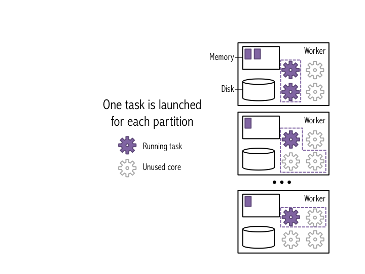
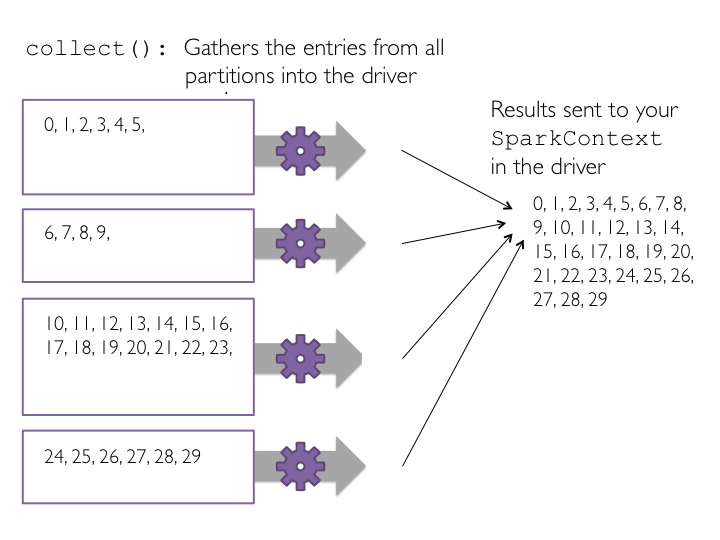

# RDDs Transformations and Actions

## Objectives

* Apply the `map(func)` transformation to apply a given function on all elements of an RDD in different partitions. 
* Use `collect()` action to trigger the processing stage of spark's lazy evaluation. 
* Use `count()` action to calculate the number of elements of a parallelized RDD.
* Use `filter(func)` to filter unwanted data from RDDs.
* Develop an understanding of Python's lambda functions for RDDs processing. 

### Introduction

In previous lab, we saw how to create an RDD from a Python list object, set the number of logical partitions and change basic RDD properties. Let's first import the intRDD we created earlier and tranform the elements following the map-reduce approach. 


```python
# Include the code from previous lab to create an intRDD[1,2,..,1000]

```

At this point, we have created an RDD containing a sequence of numbers and split it into a number of partitions. We shall now try to execute basic data manipulation operations on this RDD and inspect the outcome. Data analysis usually requires the analyst to perform certain operations on every element of a dataset. In Spark such analyses tasks are run in parallel to process a subset of data in parallel to other subsets. 

## The `map(func)` transformation 

`map(func)` is the most commonly used and one of the basic transformations in Spark. It applies a function `func` to each data element of an RDD and outputs a resulting dataset. Running `map(func)` on a datase launches a **single stage** of tasks. A stage is a group of tasks that all perform the same computation, but on different subsets of data. Tasks are launched for each partition as shown below:



a **TASK** is a unit of execution that runs on a single machine. When we execute `map(func)` in a partition, a new task applies `func` to all entries of data in that partition, outputting a new partition. In the example above, a dataset has been broken into 4 partitions, so four `map(func)` tasks are launched in each partition. 

Following figure shows this mechanism for a smaller example, similar to our `intRDD` . 


#### `map(func)` : Each task creates a new partition by calling `func(e)` on each element `e` from the original partition. 


### Applying Map transformation

When applying a `map(func)` transformation, each item in the parent RDD maps to one element in the resuting RDD i.e. the parent RDD `intRDD` has 100 elements, the new RDD post map transformation will also have 100 elements. 

Let's try to subtract 1 from each value in the intRDD.

1. create a function `subtract()` to subtract 1 from input integer. 
2. pass each element from `intRDD` to `map(func)` where func refers to the `subtract()` function from step 1. 
3. Use `toDebugString()` to see the transformation lineage. 


```python
# Create sub function to subtract 1

def subtract(value):

    """"Subtracts one from `value`.

    Input:
       value (int): A number.

    Returns:
        int: `value` minus one.
    """

    return None

# Transform intRDD through map transformation using sub function
# Because map is a transformation and Spark uses lazy evaluation, no jobs, stages,
# or tasks will be launched when we run this code.
subtractRDD = None

# Let's see the subtractRDD transformation hierarchy


# b'(5) PythonRDD[1] at RDD at PythonRDD.scala:49 []\n 
# |  ParallelCollectionRDD[0] at parallelize at PythonRDD.scala:184 []'
```

## The `collect()` action method

If we want to view the contents of resulting RDD i.e. `subtractRDD`, we would need to create a new list on the driver from the data distributed in partitions. The `RDD.collect()` method is used for this purpose. You must be careful when using the collect method to ensure that the driver has enough memory for the collected data, or the driver may crash. 


```python
# Let's collect the data using .collect on SubtractRDD

```

We can see that 1 has been subtracted from our original list 1 - 1000 , which now contains a 0 - 999. 

>The `collect()` method is the first **action** operation that we have encountered. Action operations cause Spark to perform the (lazy) transformation operations that are required to compute the RDD returned by the action. In our example, this means that tasks will now be launched to perform the parallelize, map, and collect operations.

Have a look at following figure to further strengthen the intuition around the `collect()` method. 




## The `count()` action method

`count()` is another basic action that is used to count the number of elements in an RDD. Since `map()` creates new RDD with same number of elements as base RDD, applying `count()` to base and resulting RDD should return the same result. Remember `count()` is an action operation. Had we not called `collect()` earlier, Spark would now perform the evaluation. 

Let's use this method to count elements in our RDDs to see if it meets our expectations.   


```python
# Count the elements in base and resulting RDDs

# 1000 1000
```

Each task counts the entries in its partition and sends the result to  SparkContext, which adds up all of the counts. The figure below shows what would happen if we ran count() on a small example dataset with just four partitions.


## The `filter(func)` method

We shall now create another RDD which would only contain values less than threshold, say 10. A `filter(func)`operation is used for filtering out unwanted data elements. `filter(func)` is a transformation method that creates a new RDD by applying `func` to each element of the parent RDD and only returns those values where `func` returns a `True` value, dropping other elements.

Let's try to apply the filter transformation using steps similar to `map(func)` seen earlier. 

1. Create a function `lessThanTen()` that takes an integer values to identify if it is < 10
2. Pass the `subRDD` elements as input to `lessThanTen()` to check for the set condition in step 1.
3. return a True or a False value back to `filter()` to be stored in `filteredRDD`.
4. Collect to trigger the transformation and view the results of `filteredRDD`.


```python
# Define a function to filter a single value
def lessThanTen(value):

    """Return whether value is below ten.

    Input:
        value (int): A number.

    Returns:
        bool: Whether `value` is less than ten.
    """

    return None

# Pass the function ten to the filter transformation
# Filter is a transformation so no tasks are run
filteredRDD = None

# View the results using collect()
# Collect is an action and triggers the filter transformation to run


# [0, 1, 2, 3, 4, 5, 6, 7, 8, 9]
```

### Lambda functions

Python supports the use of small one-line anonymous functions that are not bound to a name at runtime. Borrowed from LISP, these lambda functions can be used wherever function objects are required. They are syntactically restricted to a single expression. Remember that lambda functions are a matter of style and using them is never mandatory. You can always define a separate normal function instead, but using a lambda() function is an equivalent and more compact form of coding.

Lets try to implement the filter as shown above using lambda function in a single line. 


```python
# Apply the above function with filter(func) transformation using Python's lambda functions and collect the results

lambdaRDD = None

# Collect the results

# [0, 1, 2, 3, 4, 5, 6, 7, 8, 9]
```


    [0, 1, 2, 3, 4, 5, 6, 7, 8, 9]


Similarly , we can apply other filters. Try to implement a filter than only outputs even values higher than 10 and less than 30. 


```python
# Let's collect the even values lgreater than 10 and less than 30

evenRDD = None

# Collect the results

# [12, 14, 16, 18, 20, 22, 24, 26, 28]
```


    [12, 14, 16, 18, 20, 22, 24, 26, 28]


# SUMMARY

In this lab, we saw how we can apply basic transformations and actions on the data stofred within RDDs. We also looked at the Lazy Evaluation performed by Spark and learnt to differentiate between transformations and actions. We saw how lambda functions can be used as a one-line approach towards declaring functions in Spark. In next lessons, we shall see more transformations and actions on RDDs. 
